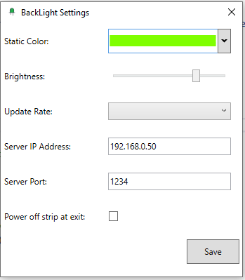

# BackLight
BackLight for TV (using ESP8266 / Windows C#):
* BackLight (C# client)
* ESPServer (arduino-based server for LED strip)


This is just a hobby project I built myself for my living room. It is an arduino-based (ESP8266) backlight for my TV. Communication between client and server is done via UDP over wireless LAN. I do not take any responsibility if you damage you, yourself, your TV, or anything else by using my code, schematics, etc. Nevertheless, I hope you can use my code and ideas for yourself :-). Have fun playing with LED pixels...! 

Sample Videos of the BackLight:
* [BackLight Test1.mpg](https://github.com/n1k0m0/BackLight/raw/master/Demo%20Videos/BackLight%20Test1.mpg)
* [BackLight Test2.mpg](https://github.com/n1k0m0/BackLight/raw/master/Demo%20Videos/BackLight%20Test2.mpg)

Basic idea:

The basic idea of my setup is the following: The windows pc's software ("client") continuesly takes screenshots of the current screen at a rate of 10Hz (every 100ms -- this is fast enough). Each screenshot is analyzed by the program. For each side of the tv screen, "small rectangles of pixels" are analyzed. The program computes the "average color" of the particular rectangle of the screen. Then, it sends a UDP packet containing all color information for the LED strip to the NodeMCU. The NodeMCU takes these color informations and sends these to the strip. Since I had some problems with "false colors", I implemented a checksum (Fletcher-16) over the complete color array. After that, the server is able to check, if it received correct colors by comparing the received checksum with its own computed checksum. If the sums do not match, the packet is discarded. This happens seldomly, and can not be seen by the viewer. But after implementing the checksums, the "false colors" disappeared. 

The server is able to receive LED colors for each individual LED. But in my client, I send for each two consecutive LEDs the same color.

The client runs hidden in the background, but shows itself as small icon in the tray (right lower corner) of Windows. By right-click, you may stop the client as well as show and hide a debug window, which shows you the color information it currently sends to the server.

Hardware:
* TV: The setup (hardware + software) is created for a full-hd (1080P) tv with 65"
* Micro controller: ESP8266 ESP-12E CH340G Wireless WIFI Internet Development Board (NodeMcu)
* Computer: I use a windows 10 pc (gigabyte brix, attached to my TV via HDMI)
* Led strip: WS2812B (300 LEDs)
* Power supply: DC 5V-24V 2A-80A

Software:
* Windows (client): Microsoft Visual Studio / C# .net 7.6.2; see BackLight folder of this project
* ESP8266 (server): Arduino; see ESPServer folder of this project

Of course, you can use my source code and adapt it to your needs. If you have any questions, don't hesitate writing me :-)

Schematics:

The following figure shows the main setup I built for my tv. First, I only created a single strip going from the left downer corner to the top, then to the right, down, and back to the left. Since the LEDs at the end of the strip did not get enough power, I created a "circle" by soldering grounds and VCCs together. This allows my setup to light up the LEDs by 75%. I would suggest to also create two wires (VCC and ground) to the upper right corner, as shown in the schematics. And don't create a circle of the BUS wire (depicted as green wire in the figure).


I have 86 LEDs on the top and 86 LEDs on the bottom of my screen.
I have 48 LEDs on the left and 48 LEDs on the right side of my screen.
This is a total of 86 * 2 + 48 * 2 = 268 LEDs for the complete screen.

How to use the Client:

Just start the BackLight.exe file. Then, in the right lower corner you see the small BackLight icon. By right-click you get a context menu with some entries:
* Static Color Mode: Enable/Disable "static color mode". This means, that you will only have a single color as background which can be set in the settings
* Settings: Opens the settings window
* Show/Hide Debug UI: Shows or hides the debug UI of the application showing the colored rectangles which are live analyzed and displayed
* Quit: Terminates the application :-) - Since the debug ui is also the "main ui", closing this window also closes the application

Settings Window:



* Static Color: Here you can select the color for the "static color mode"
* Brightness: Changes the global brightness value of the LED strip (between 0 and 255)
* Update Rate: Changes the update rate of the screen analysis (in Hertz)
* Server IP Address: Here, you have to enter the IP address of the arduino
* Server Port: Here, you have to enter the port of the arduino
* Power off strip at exit: When checked, the strip is powered off at the exit of the application
* Save-Button: Saves the settings to the hard drive using .net settings. This button is only active, if there are actual changes in the setting's values

If you close the window without pressing the save button, nothing will be changed.

Network protocol:

The UDP packet starts with 1 byte for the brightness of all following pixels.
After that, the UDP packet may consist of an "arbitrary" number of LED informations (array), where a single LED information is:

```c
 struct LED_information
 {
  byte pixelLo;   // low byte of the offset of the pixel which should be changed
  byte pixelHi;   // high byte of the offset of the pixel which should be changed
  byte red;       // red part of pixel color
  byte green;     // green part of pixel color
  byte blue;      // blue part of pixel color
 }
```

The last two bytes of the packet have to be a "Fletcher-16 checksum" over the brightness byte, the previous array of LED informations, and two zero bytes (0x00). See https://en.wikipedia.org/wiki/Fletcher%27s_checksum#Fletcher-16 for details on that checksum.
 
# Compiling your own BackLight:

Client: 

You need Visual Studio. I used Visual Studio Community edition 2019 (see https://visualstudio.microsoft.com/vs/)
Just clone/download this repository. Then, open the BackLight/BackLight.sln in Visual Studio 2019. Compile the project. Don't forget to switch from DEBUG compilation to RELEASE compilation. You may also download the current build which I uploaded to the repository (see "Builds" folder).

Server:

You need the Arduiono IDE. I used the 1.8.9 version (see https://www.arduino.cc/en/Main/Software).
Open ESPServer/ESPServer.ino with the arduino IDE. Compile it and upload it to your ESP8266. You also need to download the Adafruit Neo Pixel library. In the IDE go to "Tools/Manage Libraries") and download it. 
